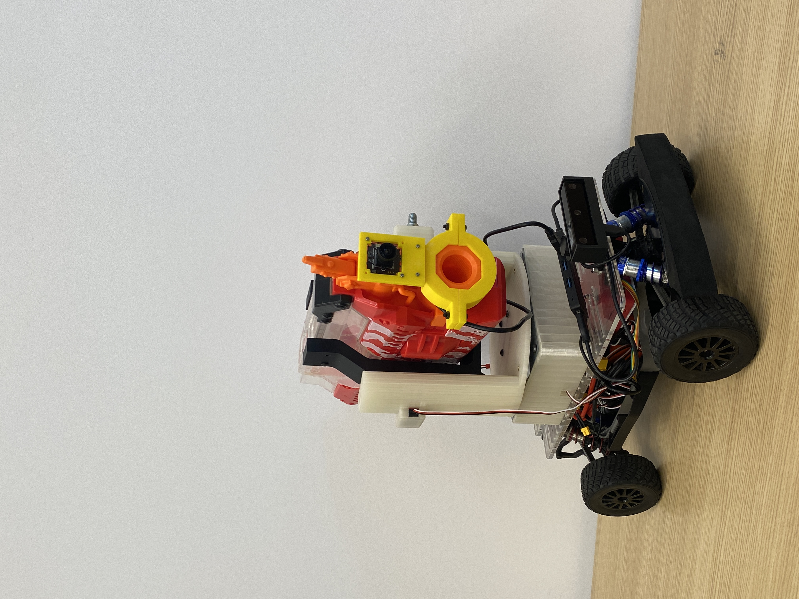

# 🎯 AprilTag Turret — Spring 2026 Final Project (Team 2)

**UCSD ECEMAE-148 | Spring 2026**

An autonomous servo-controlled turret mounted on an RC car chassis that detects AprilTag fiducial markers using a USB camera and shoots at them in real time using a flywheel-based shooter system.

---

## 📽️ Demo Video
[](https://www.youtube.com/watch?v=diLbjjhN33Y)

https://github.com/UCSD-ECEMAE-148/148sp26-spring-2026-final-project-team-2/raw/main/photos_and_videos/IMG_8658.MOV

---

## 👥 Team Members
- Christopher Cardella
- Jasper Ha
- John Beers
- Ajna Salihovic

---

## 🤖 Project Overview

This project implements a real-time AprilTag detection and targeting system. A USB camera captures frames, detects AprilTag markers, and uses PID control to aim a servo-mounted turret at the target. Once aimed, a flywheel shooter fires at the tag. The system runs on a Raspberry Pi over SSH and is controlled via keyboard input.

### Key Features
- Real-time AprilTag detection using OpenCV
- PID-controlled pan/tilt servo aiming
- Flywheel shooter with configurable pulse parameters
- Keyboard-controlled flywheel toggle (press `F`)
- Timeout-based target tracking with lost-target handling
- Deadreckon and Kalman filter odometry scripts included

---

## 🛠️ Hardware

| Component | Details |
|---|---|
| Platform | RC car chassis |
| Compute | Raspberry Pi |
| Camera | USB Camera |
| Turret | Servo-controlled pan/tilt mount |
| Shooter | Flywheel with ESC (PWM controlled) |
| Trigger | Servo (PWM controlled) |

---

## 📦 Software Dependencies

```bash
pip install opencv-python numpy pupil-apriltags
```

You will also need:
- Python 3.8+
- A servo/ESC controller library compatible with your Pi (e.g. `pigpio` or similar)

---

## 🗂️ File Structure

| File | Description |
|---|---|
| `joemama.py` | **Main script** — AprilTag detection, PID aiming, flywheel + trigger control |
| `detect.py` | Standalone AprilTag detection |
| `oakd_detect.py` | OAK-D camera detection variant |
| `shoot.py` | Shooter test script |
| `servotester.py` | Servo calibration and testing |
| `servocalib.py` | Servo calibration utility |
| `deadreckon.py` | Dead reckoning odometry |
| `kalmanDeadreckon.py` | Kalman filter odometry |
| `monoDeadreckon.py` | Monocular dead reckoning |
| `usbshoot.py` / `usbshoot2-8.py` | USB camera shooter iterations |
| `usbshoot_flyon.py` | Flywheel-on shooter variant |
| `calibMonoDeadreckon.py` | Monocular calibration |
| `camera_calibration.py` | Camera calibration tool |
| `cal_image_cap.py` | Calibration image capture |
| `board_creator.py` | AprilTag board generator |
| `usb_pid.py` | USB PID controller |
| `usbcalib.py` | USB camera calibration |
| `usbsave.py` | USB image saving utility |
| `calibration.json` | Camera calibration parameters |

---

## 🚀 How to Run

### 1. Clone the repository
```bash
git clone git@github.com:UCSD-ECEMAE-148/148sp26-spring-2026-final-project-team-2.git
cd 148sp26-spring-2026-final-project-team-2
```

### 2. Install dependencies
```bash
pip install opencv-python numpy pupil-apriltags
```

### 3. Run the main script
```bash
python3 joemama.py
```

### Controls
| Key | Action |
|---|---|
| `F` | Toggle flywheel on/off |
| `Ctrl+C` | Exit |

---

## ⚙️ Configuration (joemama.py)

Key parameters you can tune at the top of `joemama.py`:

| Parameter | Default | Description |
|---|---|---|
| `KP_PAN` / `KP_TILT` | 7.0 | PID proportional gain |
| `KD_PAN` / `KD_TILT` | 0.10 | PID derivative gain |
| `MAX_SERVO_STEP` | 10.0 | Max servo movement per frame |
| `TRIGGER_THRESHOLD` | 0.05 | Aiming error threshold to fire |
| `LOST_TIMEOUT` | 2.0 s | Seconds before target is considered lost |
| `FLYWHEEL_PULSE_MIN/MAX` | 1000–2000 | Flywheel ESC pulse range (µs) |
| `TRIGGER_PULSE_MIN/MAX` | 1000–1500 | Trigger servo pulse range (µs) |
| `FLYWHEEL_SPINUP_DELAY` | 3.0 s | Spinup time before trigger is allowed |

---

## 🧠 How It Works

1. **Detection** — USB camera captures frames; OpenCV finds AprilTag poses
2. **Aiming** — PID controller calculates pan/tilt error and moves servos
3. **Spinup** — User presses `F` to enable flywheel; system waits for spinup delay
4. **Fire** — Once the turret is within `TRIGGER_THRESHOLD` of the target, the trigger servo fires
5. **Lost target** — If no tag is detected for `LOST_TIMEOUT` seconds, the turret resets

---

## 🖥️ CAD Design


---

## 📸 Photos




---

## 📝 Acknowledgements
- UCSD ECEMAE-148 Course Staff
- [pupil-apriltags](https://github.com/pupil-labs/apriltags) library
- OpenCV community
